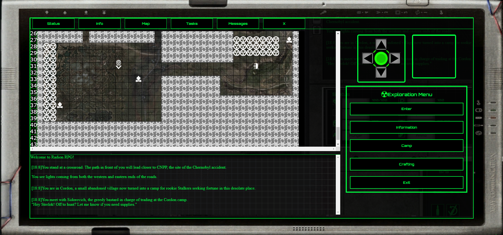

<h1 align="center">Isaac Kim</h1>
<h3 align="center">Full-stack engineer trainee from France</h3>

  

- 💻 Portfolio (WIP) -> **https://spiritquazus.github.io/Portfolio/portfolio-DXM/static/html/intro.html**

- ⚙️ WIP -> **Project psyP (game dev), Project HOGA (productivity app)**
  
- 💼 Working -> **Luxolis**

- 📖 Studying -> **React, Node.js, Django, TypeScript, C#**

- 🤝 Looking for collaborators -> **Project psyP**

- 💬 Can speak fluently -> English, Korean, French, Japanese

- 📫 Contact -> **kimisaac010@gmail.com**

<h3 align="left">Connect with me:</h3>

<h3 align="left">Languages:</h3>
 
 
 
  
 
 

<h3 align="left">Frameworks:</h3>
 

  
  

<h3 align="left">Tools:</h3>

 
 
 
 

 
 

 

<h1 align="center">Current Project: HOGA</h1>

</img>

HOGA is a web-based productivity app with several key features such as API integration with popular application such as Spotify, Youtube, LLM (Gemini, ChatGPT...). Its primary purpose is to provide users all the necessary tools to plan and execute sessions, whether work or study-related, all from a single page.

 

<h1 align="center">Hobby Project: psychoPhobia</h1>

</img>
 
</img>

Based on the world of the movie STALKER by Andrei Tarkovsky and the subsequent, world-famous video-game series of the same name by GSC studios, Stalker psychoPhobia is a fan-project entirely made on vanilla JavaScript. I've started this game from scratch in April 2024, back when I just started learning coding. The purpose of this project was for me to practice my first language (JS/HTML/CSS) and get familiar with new concepts by integrating them into this project as I learn them.

 

